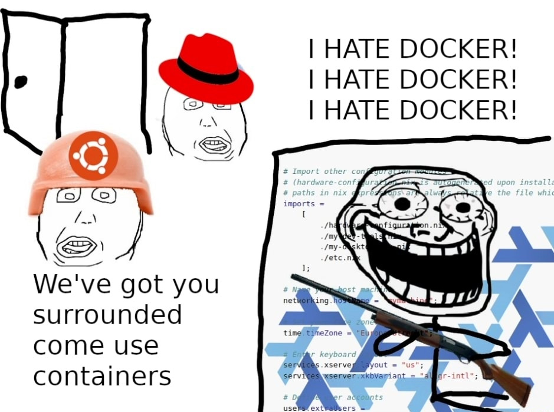
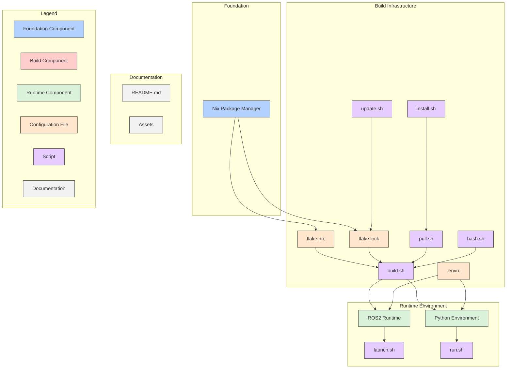

# Arcturus Nix :shipit:

The easiest way to get started with development on all_seaing_vehicle with native performance, powered by the Nix package manager

## A quick introduction



And so it begins…

## Technical overview



Generated with [GitDiagram](https://gitdiagram.com/arcturusnavigation/arcturus_nix).

## Getting up and running (in less than a minute)

> [!IMPORTANT]
> See [what is and isn't supported](#what-is-and-isnt-supported) for more information.

Run the following in a Bash shell on a Linux-based system to build individual Python nodes (simulations and nodes requiring YOLO models will not work).
Use this if you want to be on the bleeding edge of development, build code fast and cut through bloat, and get a taste of [NixOS god complex](https://www.reddit.com/r/NixOS/comments/kauf1m/dealing_with_post_nixflake_god_complex/).
Full reproducibility is [theoretically guaranteed](https://github.com/ArcturusNavigation/fish-n-ships), and dependency specifications, environment setup, and the like are much clearer and easier to change in Nix than in a Docker container.

Do not use this if you don't like Linux, hate Nix, don't like cutting edge technology, and don't want to be part of the software revolution.
You can [run from Nix](https://github.com/ArcturusNavigation/arcturus_docker), but [you can't hide](https://www.reddit.com/r/Nix/comments/19a2vqq/anyone_else_replacing_docker_compose_with_nix/).

1. Install the [Nix package manager](https://github.com/DeterminateSystems/nix-installer) (if you install from another source, [make sure flakes are enabled](https://nixos.wiki/wiki/Flakes#Other_Distros,_without_Home-Manager)—scroll up for NixOS-specific instructions)
2. Run this in a Bash shell wherever you want to clone this repository:

```bash
git clone https://github.com/ArcturusNavigation/arcturus_nix
cd arcturus_nix
nix develop
chmod +x *.sh
install
```

If you are on a resource-constrained system, suffer in silence while your computer attempts to build the entirety of the Arcturus ROS codebase and its dependencies from source—this may take a while.
Work is currently underway to automate this using a locally hosted build server, but in the meantime enjoy the [Gentoo user experience](https://wiki.gentoo.org/wiki/Why_build_from_sources).

3. The last line of the install script should tell you how to run your first node. It should be (note the period):

```bash
. run.sh module_name node.py
# or (aliased to):
run module_name node.py
```

Alternatively, you can simply add all modules to the build path so ROS can run them (`run.sh` does this automatically, but use the below command if you don't want to run any specific node initially):

```bash
. source.sh
```

4. Make sure you run the above command (and any other commands related to running and building nodes) from a Nix devshell (i.e. run `nix develop` prior to running any of these commands). Cloning this repository and updating dependencies are exceptions to this rule (see below).
5. To update your local environment, run this from the `arcturus_nix` directory:

```bash
git pull
nix develop
```

6. In general, after completing steps 1-2, you can run a module for the first time (since entering a devshell) using the command in step 3 and later with:

```bash
ros2 run module_name node.py
```

Other ROS commands (like `ros launch`) will work too.
You can manage the source code for all_seaing_vehicle in `dev_ws/src/all_seaing_vehicle`.

## Reproducibility

To ensure you replicate a certain environment exactly, you need two specific versions.
First, the version of this repository (the answer to the question: what build recipe are you running?).
Second, the version of the `all_seaing_vehicle` repository (the answer to the question: what code are you building?).

Before obtaining these versions, ensure you have not made any changes to the working tree.
You should not have any changes that are not pushed to the remote repository.
You can then find the versions you are using by running:

```bash
./hash.sh
# or (aliased to):
hash
```

The output should look something like this:

```txt
github:ArcturusNavigation/arcturus_nix
1dfcfe0fc43aaa2c9dcbbef88b26489dd26ff409

github:ArcturusNavigation/all_seaing_vehicle
e16e44c8a35bdaa9a0468624e0cc4b2b5fd377fa
```

Now, say you have this output and you want to reproduce this setup on another machine.
We'll refer to the `arcturus_nix` hash as `hash1` and the `all_seaing_vehicle` hash as `hash2`.
Replace step 2 with the following:

```bash
git clone https://github.com/ArcturusNavigation/arcturus_nix
cd arcturus_nix
git checkout hash1  # in this example, 1dfcfe0fc43aaa2c9dcbbef88b26489dd26ff409
nix develop
chmod +x *.sh
pull hash2  # in this example, e16e44c8a35bdaa9a0468624e0cc4b2b5fd377fa
build
```

Remember to substitute `hash1` and `hash2` with the corresponding versions from the output of `hash`.
Everything from step 3 onwards can now be applied and your environment will update accordingly.
It is important you do not make changes to the environment so your working tree stays clean.
If you are debugging an error, you should also run the same sequence of commands in the same order to reproduce it.
If the error still cannot be reproduced, enter the devshell with `nix develop -i` instead of `nix develop` (see below).

### Reproducibility in Production

It is important to note that to achieve true reproducibility, you will want to clear the development shell of system packages.
You can do that like so:

```bash
nix develop -i
```

While not recommended for ordinary development, you should absolutely use this in production to realize the full benefits of Nix.
You can launch specific nodes in `all_seaing_bringup` with:

```bash
./launch.sh node.py
# or (aliased to):
launch node.py
```

This will automatically spawn the reproducible devshell and run `ros2 launch` under the hood.

### Other commands

`pull <ref>` (`./pull.sh <ref>`) will get the latest version of the `all_seaing_vehicle` repository or the specified revision and set up `dev_ws`. It will not build the Nix packages.

`build` (`./build.sh`) will run the Nix build process for the project. `dev_ws` must have already been set up. `install` runs `pull` then `build`. Splitting up the commands allows you to build different versions of the `all_seaing_vehicle` codebase (not just the latest one).

`update <ref>` (`./update.sh <ref>`) will update `all_seaing_vehicle` to the specified revision or to the latest version if no revision is specified and rebuild the project. You may get an error saying things have already been built, which is fine.

## Development

For those interested in contributing to this repository (that is, the build repository for `all_seaing_vehicle`), note that there is a secondary development shell `dev` that can be launched like so:

```bash
nix develop .#dev
```

This features pre-commit hooks with automatic formatting, among other things.
We also have a `.envrc` file to enable this shell automatically with [direnv](https://direnv.net/).
This is *not* the shell you should be using for building `all_seaing_vehicle` (that is `default`).

## FAQs

### I have an error running command X. What should I do?

[File an issue](https://github.com/ArcturusNavigation/arcturus_nix/issues/new) as soon as possible so we can fix it.
Here are some quick steps that will almost certainly diagnose it:

1. Update this repository (`arcturus_nix`) to the latest version with `git pull` (from the root directory)
2. Update `all_seaing_vehicle` to the latest version with `update` (inside a devshell)

If the above two steps do not resolve the issue or cannot be run because you want to test a specific version, then try starting from a clean state (see below):

1. `rm -rf dev_ws` and then re-run `install` (inside a devshell)
2. Delete your local copy of this repository and start from step 1 again
3. If you need a specific version of either this repository or `all_seaing_vehicle`, record your current version with `hash` (inside a devshell) and then follow the steps in [Reproducibility](#reproducibility) after deleting your copy of this repository or just `dev_ws`

If that *still* does not work, you can downgrade to the [Docker container](https://github.com/ArcturusNavigation/arcturus_docker), but the issues should be resolved very soon once they are reproduced (check back on your issue on GitHub in a few days).

### Why should I use this instead of the Docker container?

This setup is vastly superior to the Docker infrastructure in many ways; we'll name a few important benefits here, but you may want to take a look at [fish-n-ships](https://github.com/arcturusNavigation/fish-n-ships) for a full technical report.
One of the major benefits is that you don't have to deal with the virtualization (and jank) of Docker (you might even be able to use your GPU!), so you get better performance and (once the Hydra server is set up) faster builds.
You also get the elegance of Nix, which makes it clear what packages you need as dependencies and what versions of those packages you need, for each module and for the system as a whole.
Nix does this in a much better and more reproducible way than ROS, which ensures you are able to run the exact same development environment as everyone else (the same environment used in production!) on any machine at any time.
Nix drastically simplifies dependency specifications and the overall build process for you, eliminating "dependency hell" and "it works on my machine."

### What is and isn't supported?

Currently, only Python nodes on Linux-based systems have been tested.
Other systems may not work.
Building almost all nodes intended for local testing (those in paths like `module_name/module_name/node.py`) is supported.
YOLO models and nodes that depend on them, however, are not supported.
Neither is Gazebo (VRX) simulation supported.
Both of these are planned for the future, but omitted for now due to excess bloat that would cause an unsustainable influx of jank in the Nix build process at this stage in its development.
All nodes should have their dependencies specified, but if a node that isn't listed as unsupported does not build, please [file an issue](https://github.com/ArcturusNavigation/arcturus_nix/issues/new).

### Is it any good?

[Yes, very](https://news.ycombinator.com/item?id=3067434).
